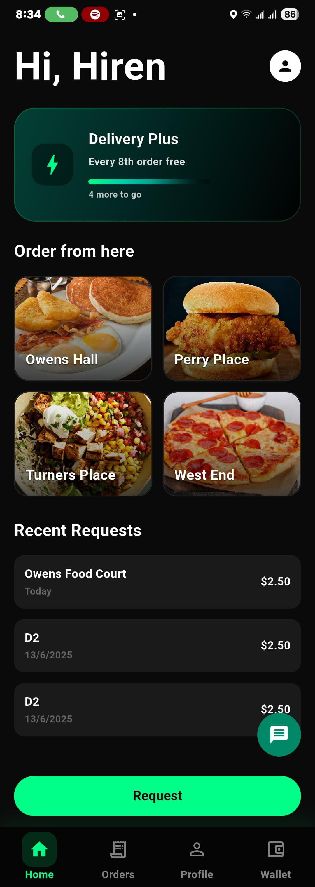
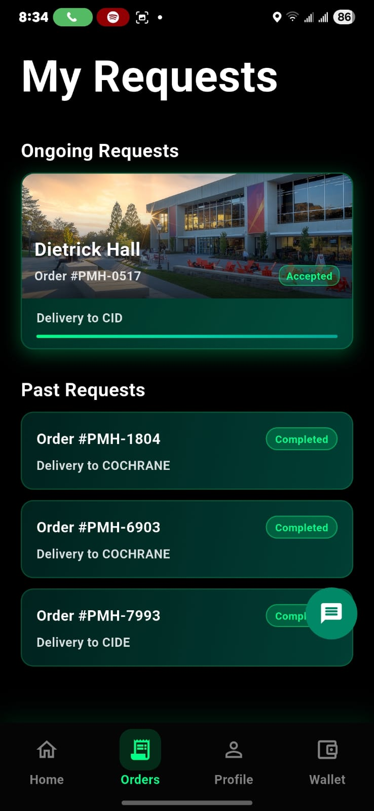
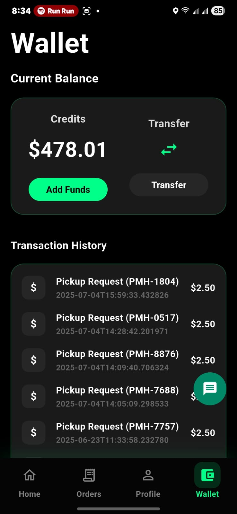
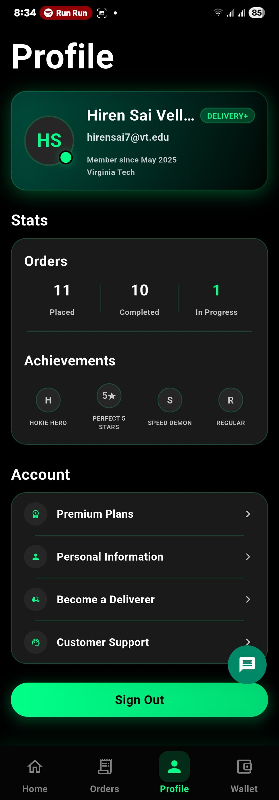

# Nible - Campus Delivery Service App

<div align="center">
  

  **Fast, Reliable, Student-Powered Campus Deliveries**

  [](https://flutter.dev)
  [](https://firebase.google.com)
  [](https://stripe.com)
</div>

---

## 📱 About Nible

Nible is a comprehensive campus delivery service application built with Flutter, designed to facilitate quick and efficient deliveries within campus communities. Students can request deliveries, become delivery partners, and earn while helping their peers.

### ✨ Key Features

- 🚀 **Real-time Delivery Tracking** - Track your deliveries from pickup to drop-off
- 💬 **In-App Messaging** - Communicate directly with delivery partners
- 💳 **Secure Payments** - Stripe-powered payment processing
- 👥 **Friend Transfers** - Send credits to friends easily
- 💰 **Digital Wallet** - Manage earnings and credits in one place
- 📍 **Campus Locations** - Pre-configured campus delivery points
- ⭐ **Rating System** - Rate and review delivery experiences
- 🔔 **Push Notifications** - Stay updated on delivery status
- 📦 **Order History** - Track all past deliveries
- 🎯 **Dual Mode** - Be a customer or a delivery partner

---

## 🏗️ Architecture

### Tech Stack

- **Framework**: Flutter 3.7.2
- **Language**: Dart
- **Backend**: Firebase (Authentication, Firestore, Cloud Functions, Storage)
- **Payments**: Stripe
- **Push Notifications**: Firebase Cloud Messaging
- **State Management**: StatefulWidget with Streams
- **Image Handling**: image_picker

### Project Structure

```
lib/
├── constants/
│   └── colors.dart              # App color scheme and theming
├── models/
│   ├── user.dart                # User data model
│   ├── delivery.dart            # Delivery request model
│   ├── conversation.dart        # Chat conversation model
│   └── message.dart             # Message model
├── screens/
│   ├── splash_screen.dart       # Initial loading screen
│   ├── onboarding_screen.dart   # User onboarding flow
│   ├── login_screen.dart        # Authentication - Login
│   ├── signup_screen.dart       # Authentication - Sign up
│   ├── main_screen.dart         # Main navigation hub
│   ├── home_content.dart        # Home dashboard
│   ├── delivery_mode_screen.dart # Switch to delivery mode
│   ├── request_pickup_screen.dart # Create delivery request
│   ├── order_screen.dart        # Active orders view
│   ├── order_tracking_screen.dart # Real-time order tracking
│   ├── delivery_pickup_screen.dart # Delivery partner pickup
│   ├── delivery_navigation_screen.dart # Navigation for delivery
│   ├── delivery_rating_screen.dart # Rate completed delivery
│   ├── chat_screen.dart         # In-app messaging
│   ├── wallet_screen.dart       # Digital wallet management
│   ├── transfer_screen.dart     # Send credits to friends
│   ├── subscription_screen.dart # Subscription plans
│   ├── profile_screen.dart      # User profile
│   ├── profile_info_screen.dart # Edit profile info
│   └── card_payment_screen.dart # Add payment methods
├── services/
│   ├── auth_service.dart        # Firebase authentication
│   ├── firebase_service.dart    # Core Firebase operations
│   ├── delivery_service.dart    # Delivery management
│   ├── order_service.dart       # Order processing
│   ├── chat_service.dart        # Messaging functionality
│   ├── stripe_service.dart      # Payment processing
│   └── friend_transfer_service.dart # Credit transfers
├── widgets/
│   ├── delivery_card.dart       # Delivery request card widget
│   └── chat_bubble.dart         # Chat message bubble
├── firebase_options.dart        # Firebase configuration
└── main.dart                    # App entry point

functions/
└── index.js                     # Firebase Cloud Functions
```

---

## 🚀 Getting Started

### Prerequisites

- Flutter SDK (3.7.2 or higher)
- Dart SDK (3.7.2 or higher)
- Android Studio / Xcode (for mobile development)
- Firebase account
- Stripe account (for payments)
- Node.js (for Firebase Functions)

### Installation

1. **Clone the repository**
   ```bash
   git clone https://github.com/hirensai111/Nible.git
   cd Nible
   ```

2. **Install Flutter dependencies**
   ```bash
   flutter pub get
   ```

3. **Set up Firebase**

   Install FlutterFire CLI:
   ```bash
   dart pub global activate flutterfire_cli
   ```

   Configure Firebase for your project:
   ```bash
   flutterfire configure
   ```

   This will:
   - Create/select a Firebase project
   - Generate `lib/firebase_options.dart`
   - Download configuration files for Android/iOS

4. **Configure Stripe**

   Create a `.env` file in the root directory:
   ```bash
   cp .env.example .env
   ```

   Add your Stripe publishable key:
   ```
   STRIPE_PUBLISHABLE_KEY=pk_test_your_key_here
   ```

5. **Set up Firebase Cloud Functions**
   ```bash
   cd functions
   npm install
   ```

6. **Configure Android**

   Add your `google-services.json` to:
   ```
   android/app/google-services.json
   ```

7. **Configure iOS**

   Add your `GoogleService-Info.plist` to:
   ```
   ios/Runner/GoogleService-Info.plist
   ```

---

## 🔧 Configuration

### Firebase Setup

1. **Enable Authentication**
   - Go to Firebase Console → Authentication
   - Enable Email/Password authentication

2. **Create Firestore Database**
   - Go to Firestore Database
   - Create database in production mode
   - Set up the following collections:
     - `users` - User profiles
     - `requests` - Delivery requests
     - `conversations` - Chat conversations
     - `messages` - Chat messages
     - `transactions` - Payment transactions
     - `orderCounter` - Order number tracking

3. **Deploy Security Rules**

   Set up Firestore security rules to protect user data:
   ```javascript
   rules_version = '2';
   service cloud.firestore {
     match /databases/{database}/documents {
       match /users/{userId} {
         allow read, write: if request.auth != null && request.auth.uid == userId;
       }
       match /requests/{requestId} {
         allow read: if request.auth != null;
         allow create: if request.auth != null;
         allow update, delete: if request.auth != null &&
           (request.auth.uid == resource.data.userId ||
            request.auth.uid == resource.data.deliveryPersonId);
       }
       match /conversations/{conversationId} {
         allow read, write: if request.auth != null &&
           request.auth.uid in resource.data.participants;
       }
       match /messages/{messageId} {
         allow read, write: if request.auth != null;
       }
       match /transactions/{transactionId} {
         allow read: if request.auth != null &&
           request.auth.uid == resource.data.userId;
         allow create: if request.auth != null;
       }
     }
   }
   ```

4. **Enable Cloud Messaging**
   - Go to Cloud Messaging in Firebase Console
   - Enable the Cloud Messaging API

5. **Deploy Cloud Functions**
   ```bash
   cd functions
   firebase deploy --only functions
   ```

### Stripe Setup

1. Get your API keys from [Stripe Dashboard](https://dashboard.stripe.com/apikeys)
2. Add the publishable key to your `.env` file
3. Configure webhook endpoints for payment confirmations (optional)

---

## 🏃 Running the App

### Development Mode

```bash
# Run on connected device/emulator
flutter run

# Run on specific device
flutter devices
flutter run -d <device-id>

# Run in release mode
flutter run --release
```

### Building

**Android APK:**
```bash
flutter build apk --release
```

**Android App Bundle:**
```bash
flutter build appbundle --release
```

**iOS:**
```bash
flutter build ios --release
```

---

## 📱 App Features in Detail

### For Customers

1. **Request a Delivery**
   - Select pickup location from campus buildings
   - Add delivery details and special instructions
   - Set delivery fee
   - Make secure payment via Stripe

2. **Track Deliveries**
   - Real-time status updates
   - Chat with delivery partner
   - Receive push notifications
   - View estimated delivery time

3. **Manage Wallet**
   - Add funds via credit card
   - Transfer credits to friends
   - View transaction history
   - Cash out earnings

4. **Rate & Review**
   - Rate delivery experience
   - Provide feedback
   - View delivery history

### For Delivery Partners

1. **Accept Deliveries**
   - Browse available delivery requests
   - View delivery details and earnings
   - Accept requests instantly
   - Navigate to pickup/dropoff locations

2. **Earn Money**
   - Flexible earning opportunities
   - Track total earnings
   - Cash out anytime (minimum $10)
   - View earnings history

3. **Communication**
   - Chat with customers
   - Update delivery status
   - Upload delivery proof photos
   - Receive notifications

---

## 🎨 Design System

### Color Scheme

The app uses a modern dark theme with green accents:

- **Primary Green**: `#00FF00` - CTAs and highlights
- **Background**: `#0A0A0A` - Main background
- **Surface**: `#121212` - Cards and surfaces
- **Card Color**: `#1A1A1A` - Elevated elements
- **Border Green**: `#1A3A1A` - Borders and dividers

### Typography

- System fonts with various weights
- Clear hierarchy for readability
- Accessible contrast ratios

---

## 🔐 Security Considerations

### Important Notes

⚠️ **Before deploying to production:**

1. **Never commit sensitive keys** to version control
   - Use environment variables for API keys
   - Keep `.env` in `.gitignore`
   - Use separate keys for dev/staging/prod

2. **Implement proper Firebase Security Rules**
   - Restrict read/write access based on authentication
   - Validate data on the server side
   - Use Cloud Functions for sensitive operations

3. **Secure Payment Processing**
   - Never store full card details
   - Use Stripe's PCI-compliant infrastructure
   - Implement webhook verification for payment events

4. **User Data Protection**
   - Follow GDPR/privacy regulations
   - Implement data encryption
   - Provide data export/deletion options

---

## 🧪 Testing

```bash
# Run all tests
flutter test

# Run with coverage
flutter test --coverage

# Run integration tests
flutter drive --target=test_driver/app.dart
```

---

## 📦 Deployment

### Android

1. Configure signing in `android/app/build.gradle`
2. Generate upload keystore
3. Build app bundle: `flutter build appbundle --release`
4. Upload to Google Play Console

### iOS

1. Configure signing in Xcode
2. Update bundle identifier
3. Build: `flutter build ios --release`
4. Upload to App Store Connect via Xcode

---

## 🤝 Contributing

Contributions are welcome! Please follow these guidelines:

1. Fork the repository
2. Create a feature branch (`git checkout -b feature/AmazingFeature`)
3. Commit your changes (`git commit -m 'Add some AmazingFeature'`)
4. Push to the branch (`git push origin feature/AmazingFeature`)
5. Open a Pull Request

### Code Style

- Follow the [Effective Dart](https://dart.dev/guides/language/effective-dart) style guide
- Use meaningful variable and function names
- Add comments for complex logic
- Format code: `dart format .`
- Analyze code: `flutter analyze`

---

## 📸 Screenshots

<div align="center">

### Home Screen


### Orders & Tracking


### Digital Wallet


### User Profile


</div>

---

## 📄 License

This project is licensed under the MIT License - see the [LICENSE](LICENSE) file for details.

---

<div align="center">
  <strong>Built with ❤️ for campus communities</strong>
</div>
